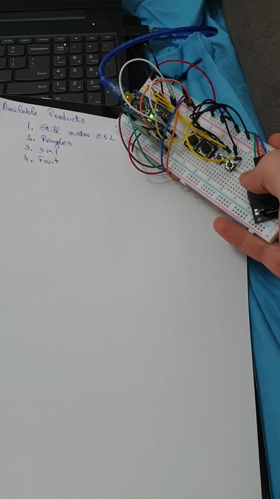
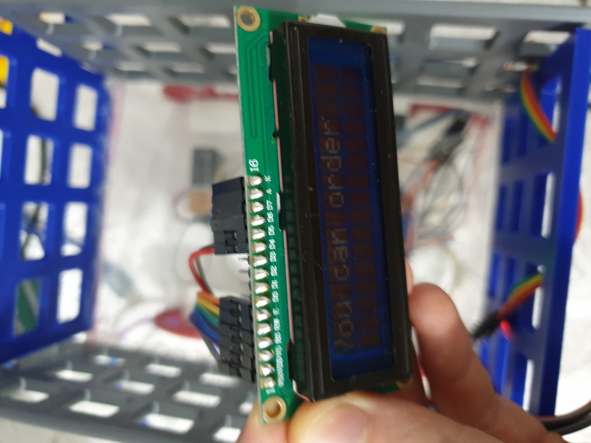
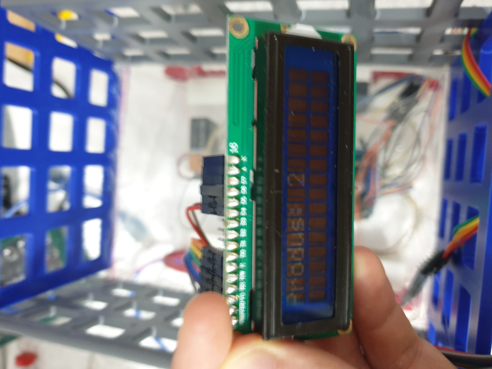

<h1><em>Smart Cart for Restaurant</em></h1>

  

  My project is designed to be used into restaurants, to help deliver the orders. Every table should have one cart and one remote control. The remote control has a group of buttons for products and a joystick which allow driving the cart to the bar and then back to the table. 
<h2> Use scenario</h2>
  When a group of persons sit at a table, they can consult the menu and then with the remote control they make an order. After that, they drive the cart to the bar, wait until the order is ready, drive it back to the table and enjoy their products.  
  An example with a list of products and a remote control.
  
  

<h2> Technical details</h2>
  First thing to do was to connect the master bluetooth to the slave bluetooth. The master bluetooth will be the bluetooth module on the remote control and the slave will be the one on the cart. The connection is made entering the bluetooth in AT mode and binding the master bluetooth to the address of the slave.  
  The customer can not drive the cart untile they push a button to make an order. 
  This is the default LCD Display message:
  
 

  After you make an order:
    
 

  The cart is easy to control because of the joystick and has enough space for a bottle, or a small plate. The remote control sends the X axis value and Y axis value to the cart where is set the direction of the cart and the speed.  
  <a href = "https://www.youtube.com/watch?v=1a4pfF7IbWM&feature=youtu.be" > Youtube video </a>
