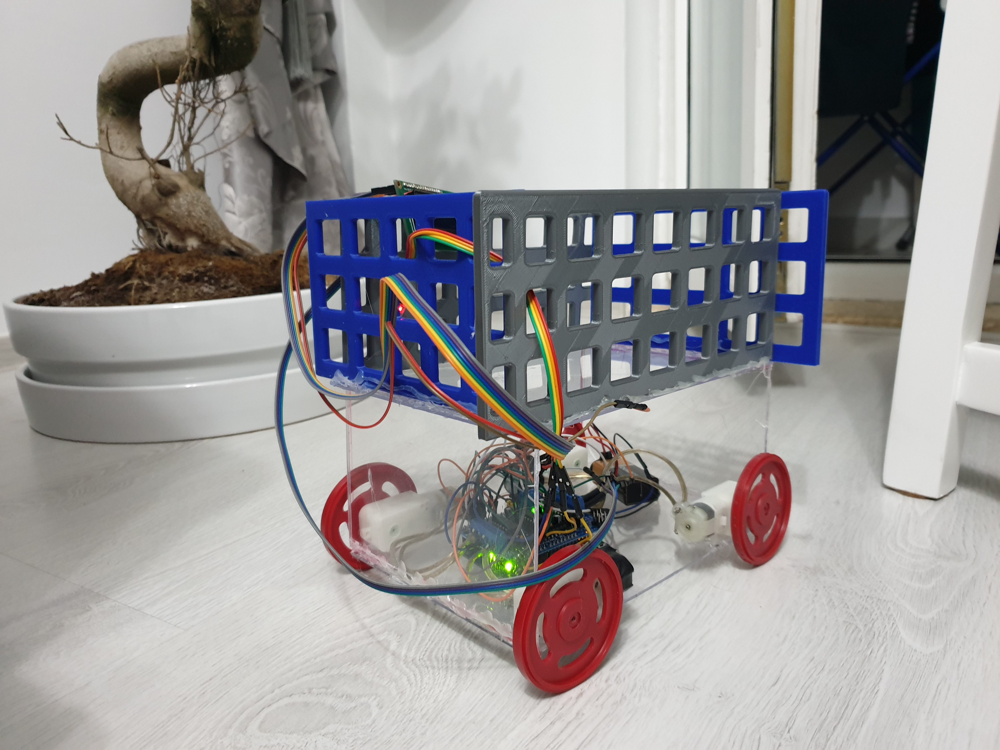

<h1><em>Smart Cart for Restaurant</em></h1>

  

  My project is designed to be used into restaurants, to help deliver the orders. Every table should have one cart and one remote control. The remote control has a group of buttons for products and a joystick which allow driving the cart to the bar and then back to the table. 
<h2> Use scenario</h2>
  When a group of persons sit at a table, they can consult the menu and then with the remote control they make an order. After that, they drive the cart to the bar, wait until the order is ready, drive it back to the table and enjoy their products. 

