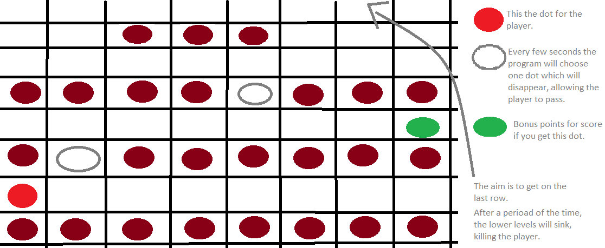
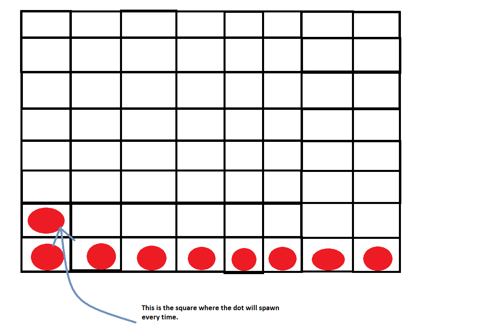

# ESCAPE TITANIC

The game presents us a DOT, who is caught in the sinking Titanic. He has to get on the on the deck as fast as he can because the lifeboats are limited. He doesn't know how to swim, so if the water catches him, he is dead.

The dot will have to face a lot of levels, some of them harder than others.

### Technical details
  * the player will have **a maximum of 3 lifes** at the beginning, but if he moves fast enough and finishes the level with a high score he will get one life if he doesn't have 3 already
  * **the faster he finishes the level, the higher the score will be**. There are also bonus dots, who will give points for score
  * every second matters because at **higher levels, Titanic will sink faster**
  * there will be a **TOP 1 highscore in the menu**, which will be saved to EEPROM with an option to reset the highscore
  
### Hardware details
  * a 8 x 8 **_matrix_** where the game will be played and there will also be some animations when powering up the Arduino board, starting a new game or making a highscore
  * **_MAX7219 drive_** for connecting and controlling the matrix
  * a **_joystick_** for the movement through the menu and for the game
  * a **_16 x 2 LCD_** where the menu of the game will be displayed. The menu consists of: **Play, Settings, Highscore, Info**
  
## HOW TO PLAY
  1. Because of the limitations of having just one color, the dot is spawning at every level in the same square
     
